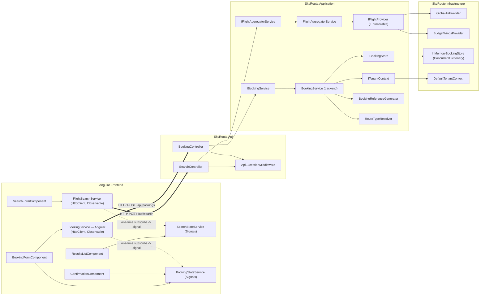

# Architecture Plan — SkyRoute Travel Platform MVP

---

## Document Metadata

| Field | Value |
|---|---|
| Document ID | ARCH-001 |
| Version | 1.0 |
| Date | 2026-07-03 |
| Status | Draft — Ready for Orchestrator Review |
| Owner | solution-architect |
| Source | `docs/requirements.md` v1.4 (Approved, esp. Section 3.10), `docs/specs/non-functional-requirements.md` v1.0 (Approved), `docs/testing/test-strategy.md` v1.0 |
| Phase | Phase 06 — Architecture Planning |
| Governance | `.claude/rules/nfr-governance.md`, `.claude/rules/spec-driven-development.md`, CLAUDE.md Section 3/11 |

### Purpose and Scope

This document does not reopen, alter, or contradict any approved requirement, business rule, NFR target, or DP-* constraint in `docs/requirements.md` v1.4 or `docs/specs/non-functional-requirements.md` v1.0. Its job is to **concretize** those already-approved constraints into a buildable project/folder/class structure, and to make the specific implementation-shape calls that requirements.md deliberately left open (FR-054/FR-055 airport source; validation library choice; exact project layout; state-management convention). Every such call is flagged explicitly as an **Architecture Decision (AD-xxx)** below and is not subject to a new Product Owner approval gate — it is an implementation-shape decision made within already-approved flexibility.

No code files, `.csproj`/`.sln` files, or `package.json` are created by this document. This is a planning artifact for Phase 10 (Feature Specifications) and Phase 12 (Implementation) to follow.

---

## 1. Architecture Decisions — Quick Reference

| ID | Decision | Rationale (tied to EOD deadline / MVP scope) |
|---|---|---|
| AD-001 | 3-project .NET solution split: `SkyRoute.Api`, `SkyRoute.Application`, `SkyRoute.Infrastructure`. Domain models live inside `SkyRoute.Application` (no separate `SkyRoute.Domain` project). | A 4th project for domain models adds ceremony (extra project file, extra reference wiring) with no benefit at this scale — DP-PERSIST-002/DP-PROTOCOL-002 are code-level constraints (no annotations), not project-separation constraints. 3 projects is the minimum split that structurally guarantees DP-PROTOCOL-001 (Application/Infrastructure never reference `Microsoft.AspNetCore.App`). |
| AD-002 | FR-054/FR-055: airport data source is a **frontend TypeScript constant** (`airports.constants.ts`). No `GET /api/airports` endpoint is built for MVP. The backend independently maintains its own static `AirportDataService` for validation, per FR-055's explicit allowance. | Saves a controller, a route, an HTTP round trip, and a loading state on the search form — meaningful time savings against the EOD deadline for a "Should Have." Addable later (AD stays reversible: wrap `AirportDataService` behind a controller with zero domain/service changes). |
| AD-003 | Validation library: **`System.ComponentModel.DataAnnotations`** (BCL, already referenced by ASP.NET Core — zero new dependency) for field-level rules, plus concrete `SearchRequestValidator`/`BookingRequestValidator` classes for cross-field/context-dependent rules (route-type-dependent document format, passenger-count-matches-array-length). | CLAUDE.md Section 14/`.claude/rules/tool-safety.md` require explicit user approval before introducing a new dependency (e.g., FluentValidation). DataAnnotations avoids that approval round-trip entirely and is sufficient for this MVP's validation surface. |
| AD-004 | Booking request carries a **full flight-detail snapshot** (provider, flight number, route, times, cabin class, per-passenger price) rather than an opaque `flightId` requiring backend lookup/matching against provider data. | FR-039 explicitly permits "sufficient flight details to uniquely identify the flight and provider" as an alternative to an identifier. Building a flight-lookup/matching capability against ASM-006's fixed mock schedule has no product value in MVP and costs implementation time. |
| AD-005 | Domain models double as API request/response contracts — no separate DTO/mapping layer. | Default `System.Text.Json` serialization requires zero attributes, so DP-PROTOCOL-002/DP-PERSIST-002 (no serialization annotations on domain models) hold without an extra mapping layer. A dedicated DTO layer remains addable later as an adapter (consistent with the DP-PROTOCOL-004/005 GraphQL/gRPC addability pattern) without violating any constraint now. |
| AD-006 | Frontend state convention (DP-013): RxJS **Observables are confined to the Angular service HTTP boundary only**. Exactly one Observable→Signal conversion point exists per data flow (via `toSignal()` from `@angular/core/rxjs-interop`, or an explicit one-time `.subscribe()` writing into a `signal()`). All state downstream of that point — templates, derived/computed values — uses Signals and `computed()` exclusively. | Gives one unambiguous, KISS rule engineers can apply mechanically instead of judgment-call mixing, satisfying DP-013's "must not be mixed arbitrarily" requirement with minimal ceremony. No NgRx or other state library is introduced (YAGNI). |
| AD-007 | A named ASP.NET Core authorization policy stub (e.g., `"RequireBookingOwner"`) is registered in `Program.cs` with an allow-all assertion, and is never applied via `[Authorize]` anywhere in MVP code. | Satisfies DP-AUTH-004/DP-POLICY-001's requirement that the *pattern* exist at zero runtime cost — costs one line of registration code, exercises nothing, changes no behavior (BR-010 unaffected). |
| AD-008 | Booking reference generation is extracted into a standalone, dependency-light `BookingReferenceGenerator` class (not a method on `BookingService`). | Goes slightly beyond DP-018's "extractable method" minimum to make it trivially unit-testable without constructing `BookingService`'s full dependency graph — negligible extra cost, meaningfully easier test authoring in Phase 13. |
| AD-009 | `GlobalAirProvider`/`BudgetWingsProvider` are placed in `SkyRoute.Infrastructure`, not `SkyRoute.Application`. | Providers are external-integration adapters by role (DP-CLOUD-005's reference pattern), even though the MVP versions are in-process mocks with no real HTTP calls (ASM-007). Placing them in Infrastructure now avoids a project move later when a provider becomes a real HTTP integration. |
| AD-010 | Fault isolation implementation detail: each provider invocation must be wrapped in its **own** try/catch *before* being included in the `Task.WhenAll` batch. | `Task.WhenAll` alone does not provide fault isolation — an unhandled exception inside one task still propagates. This is flagged explicitly so Phase 12 implementers do not introduce a subtle BR-007/FR-050 violation by assuming `Task.WhenAll` is sufficient on its own. |

---

## 2. Solution Structure

```text
SkyRoute.sln
├── src/
│   ├── SkyRoute.Api/                    (Sdk.Web — the only project referencing ASP.NET Core Mvc/Http types)
│   │   ├── Program.cs                   (composition root: DI, CORS, middleware pipeline, Kestrel)
│   │   ├── Controllers/
│   │   │   ├── SearchController.cs
│   │   │   └── BookingController.cs
│   │   ├── Middleware/
│   │   │   └── ApiExceptionMiddleware.cs
│   │   ├── appsettings.json
│   │   └── appsettings.Development.json
│   │
│   ├── SkyRoute.Application/             (Sdk — plain class library; zero AspNetCore.* references)
│   │   ├── Domain/
│   │   │   ├── Booking.cs
│   │   │   ├── PassengerDetail.cs
│   │   │   ├── FlightResult.cs
│   │   │   └── Airport.cs
│   │   ├── Contracts/
│   │   │   ├── SearchRequest.cs
│   │   │   ├── BookingRequest.cs
│   │   │   └── BookingResponse.cs
│   │   ├── Interfaces/
│   │   │   ├── IFlightProvider.cs
│   │   │   ├── IFlightAggregatorService.cs
│   │   │   ├── IBookingService.cs
│   │   │   ├── IBookingStore.cs
│   │   │   └── ITenantContext.cs
│   │   ├── Services/
│   │   │   ├── FlightAggregatorService.cs
│   │   │   ├── BookingService.cs
│   │   │   ├── BookingReferenceGenerator.cs
│   │   │   └── RouteTypeResolver.cs
│   │   ├── Validation/
│   │   │   ├── SearchRequestValidator.cs
│   │   │   └── BookingRequestValidator.cs
│   │   └── Data/
│   │       └── AirportDataService.cs     (concrete, not behind an interface — YAGNI-001)
│   │
│   └── SkyRoute.Infrastructure/          (Sdk — plain class library)
│       ├── Providers/
│       │   ├── GlobalAirProvider.cs
│       │   └── BudgetWingsProvider.cs
│       ├── Persistence/
│       │   └── InMemoryBookingStore.cs
│       └── Tenancy/
│           └── DefaultTenantContext.cs
│
└── tests/                                 (Phase 13 scope — named here only for solution completeness)
    ├── SkyRoute.Application.Tests/
    └── SkyRoute.Api.IntegrationTests/
```

**Mapping to DP-001–DP-004 (required interfaces) and DP-PROTOCOL-001:**

- `SkyRoute.Api` is the **only** project that may reference `Microsoft.AspNetCore.Mvc`/`Microsoft.AspNetCore.Http`. It contains controllers (thin, per DP-005) and the composition root.
- `SkyRoute.Application` defines all four required interfaces (`IFlightProvider`, `IFlightAggregatorService`, `IBookingService`, `IBookingStore`) plus `ITenantContext`, and contains all business logic. Because this project is a plain `Sdk`-style class library (not `Sdk.Web`) with no ASP.NET Core package reference, it is **structurally impossible** to accidentally reference `HttpContext`, `IActionResult`, or `ClaimsPrincipal` from it — this is the cheapest possible enforcement of DP-PROTOCOL-001 and DP-AUTH-001/002 (a missing reference, not a code-review rule).
- `SkyRoute.Infrastructure` contains only concrete implementations (`GlobalAirProvider`, `BudgetWingsProvider`, `InMemoryBookingStore`, `DefaultTenantContext`) and depends on `SkyRoute.Application` (for the interfaces/domain models it implements) — never the reverse. `SkyRoute.Api` depends on both `SkyRoute.Application` (for interfaces) and `SkyRoute.Infrastructure` (only inside `Program.cs`, for DI registration) — no controller or service references `SkyRoute.Infrastructure` types directly (DP-PERSIST-003).

This is a pragmatic 3-project split, not a 4+ project "onion" — deliberately sized to what a Senior Full-Stack hiring-challenge MVP needs (see AD-001).

---

## 3. Backend Component Design

### 3.1 Provider Seam — `IFlightProvider` (DP-001, DP-006, DP-019)

```csharp
public interface IFlightProvider
{
    string ProviderName { get; }
    Task<IReadOnlyList<FlightResult>> SearchAsync(SearchRequest request, CancellationToken cancellationToken);
}
```

- `GlobalAirProvider : IFlightProvider` (`SkyRoute.Infrastructure/Providers/GlobalAirProvider.cs`) — holds a private hardcoded flight schedule (ASM-006: fixed regardless of date/route, filtered only by requested cabin class per BR-009). Pricing lives in a single named method, per DP-006:
  ```csharp
  private static decimal ApplyGlobalAirPricing(decimal baseFare) =>
      Math.Round(baseFare * 1.15m, 2, MidpointRounding.AwayFromZero); // BR-001
  ```
- `BudgetWingsProvider : IFlightProvider` — same shape, its own named pricing method:
  ```csharp
  private static decimal ApplyBudgetWingsPricing(decimal baseFare)
  {
      var discounted = Math.Round(baseFare * 0.90m, 2, MidpointRounding.AwayFromZero);
      return Math.Max(discounted, 29.99m); // BR-002 — round first, then apply floor
  }
  ```
  (Rounding-then-flooring order matters for the BR-002 example: $30.00 × 0.90 = $27.00 → floor → $29.99.)
- Both providers tag every result with `ProviderName` (FR-052) before returning (DP-006 keeps pricing out of the data-construction loop — apply pricing in a `.Select()`/mapping step that calls the named method, not inline inside the loop that builds `FlightResult` objects).
- Each pricing method is directly unit-testable given only a `decimal baseFare` input (DP-019) — no HTTP context, no search request, no aggregator required.

### 3.2 Aggregation — `IFlightAggregatorService` (DP-004, BR-007, FR-049, FR-050)

```csharp
public interface IFlightAggregatorService
{
    Task<IReadOnlyList<FlightResult>> SearchAsync(SearchRequest request, CancellationToken cancellationToken);
}
```

`FlightAggregatorService(IEnumerable<IFlightProvider> providers, ILogger<FlightAggregatorService> logger)`.

Implementation shape (AD-010 — the critical detail):

```csharp
public async Task<IReadOnlyList<FlightResult>> SearchAsync(SearchRequest request, CancellationToken ct)
{
    var tasks = _providers.Select(p => SafeInvokeAsync(p, request, ct));
    var results = await Task.WhenAll(tasks);          // FR-049
    return results.SelectMany(r => r).ToList();
}

private async Task<IReadOnlyList<FlightResult>> SafeInvokeAsync(
    IFlightProvider provider, SearchRequest request, CancellationToken ct)
{
    try
    {
        return await provider.SearchAsync(request, ct);
    }
    catch (Exception ex)
    {
        _logger.LogWarning(ex, "Provider {ProviderName} failed during search", provider.ProviderName); // NFR-OBS-001
        return Array.Empty<FlightResult>();             // FR-050 — treated as empty collection
    }
}
```

The per-task try/catch inside `SafeInvokeAsync` — evaluated *before* the task is handed to `Task.WhenAll` — is what actually delivers BR-007 fault isolation. `Task.WhenAll` on its own does not swallow exceptions from individual tasks.

### 3.3 Booking — `IBookingService`, `IBookingStore`, `InMemoryBookingStore` (DP-002, DP-003, BR-004, BR-005, BR-006, BR-008)

```csharp
public interface IBookingService
{
    Task<BookingResponse> CreateBookingAsync(BookingRequest request, CancellationToken cancellationToken);
}

public interface IBookingStore
{
    Task<Booking> CreateAsync(Booking booking, string tenantId, CancellationToken ct);
    Task<Booking?> GetByReferenceAsync(string reference, string tenantId, CancellationToken ct);
    Task<bool> ExistsAsync(string reference, string tenantId, CancellationToken ct);
    Task<IReadOnlyList<Booking>> ListByTenantAsync(string tenantId, int page, int pageSize, CancellationToken ct);
}
```

`InMemoryBookingStore : IBookingStore` (`SkyRoute.Infrastructure/Persistence/`) — backed by `ConcurrentDictionary<string, Booking>` keyed by booking reference (BR-008 thread-safety, NFR-SCALE-002). No persistence-technology-specific type appears in the interface (DP-PERSIST-001) — only `Booking`, `string`, `int`, `bool`, `IReadOnlyList<T>`.

`BookingService(IBookingStore store, ITenantContext tenantContext, BookingReferenceGenerator referenceGenerator, RouteTypeResolver routeTypeResolver, ILogger<BookingService> logger)` — `CreateBookingAsync`:

1. Runs `BookingRequestValidator` (structural validation — passenger count matches array length, per-field format) → 400 with field errors if invalid (FR-041, FR-062, FR-063).
2. Re-resolves route type server-side via `RouteTypeResolver` from the flight snapshot's origin/destination (BR-003, DP-016, NFR-DATA-004) — **authoritative**, independent of anything the client submitted.
3. Validates each passenger's `documentType`/`documentNumber` against the server-resolved route type and the named pattern constants (DP-015) → 400 if mismatched.
4. Recomputes `totalPrice = flight.pricePerPassenger * passengerCount`, rounded to 2dp server-side (BR-006, NFR-DATA-002) — there is no client-submitted total to distrust in this contract (see AD-004/AD-005), so this is a pure computation, not a trust decision.
5. Calls `referenceGenerator.GenerateBookingReference(routeType)`, checks `store.ExistsAsync(...)` for collision, regenerates on collision (BR-004, NFR-DATA-001).
6. Builds a `Booking` domain object with `TenantId = tenantContext.TenantId` (DP-TENANT-003/005) and `n` `PassengerDetail` records (BR-005, NFR-DATA-003), calls `store.CreateAsync(...)`.
7. Maps the persisted `Booking` to a `BookingResponse` (FR-044).

`BookingReferenceGenerator` (`SkyRoute.Application/Services/BookingReferenceGenerator.cs`, AD-008) — standalone class, no constructor dependencies:

```csharp
public sealed class BookingReferenceGenerator
{
    public string GenerateBookingReference(RouteType routeType)
    {
        var type = routeType == RouteType.International ? "INT" : "DOM";
        var suffix = GenerateRandomSuffix(6); // RandomNumberGenerator, not System.Random — BR-004
        return $"SKY-{type}-{suffix}";
    }

    private static string GenerateRandomSuffix(int length) { /* RandomNumberGenerator-backed */ }
}
```

Independently unit-testable per DP-018 without instantiating `BookingService` at all.

### 3.4 Multi-Tenancy Seam — `ITenantContext`/`DefaultTenantContext` (DP-TENANT-001–002)

```csharp
public interface ITenantContext
{
    string TenantId { get; }
}
```

`DefaultTenantContext : ITenantContext` (`SkyRoute.Infrastructure/Tenancy/`) returns the constant `"default"`. Registered as the DI implementation for MVP (DP-TENANT-002). `BookingService` receives it via constructor injection (DP-TENANT-003) and threads `TenantId` through every `IBookingStore` call (DP-TENANT-006). `Booking` carries a `TenantId` field defaulting to `"default"` (DP-TENANT-005).

### 3.5 Auth Seam — Backend (BR-012, DP-AUTH)

**No backend `AuthService`-equivalent class exists.** DP-AUTH-003's single-`AuthService` requirement is explicitly frontend-only. The backend seam is structural, not a named class:

- No service or repository method accepts `ClaimsPrincipal`/`IIdentity` (DP-AUTH-001) — enforced structurally by `SkyRoute.Application` having no ASP.NET Core package reference (see Section 2).
- No service inspects an authentication scheme name (DP-AUTH-002) — there is no such code to write in MVP; this is a "don't add it" constraint, not a deliverable.
- The named authorization policy stub (AD-007, DP-AUTH-004/DP-POLICY-001) is registered in `Program.cs`:
  ```csharp
  builder.Services.AddAuthorization(options =>
      options.AddPolicy("RequireBookingOwner", p => p.RequireAssertion(_ => true)));
  ```
  This policy is never referenced by any `[Authorize(Policy = "RequireBookingOwner")]` attribute anywhere in MVP code (BR-010: no endpoint requires authorization). Its only purpose is to demonstrate the named-policy pattern exists at zero runtime cost, per DP-POLICY-001/003's verifiability note.

### 3.6 Centralised Exception Handling (BR-011, DP-007, FR-069)

`ApiExceptionMiddleware` (`SkyRoute.Api/Middleware/ApiExceptionMiddleware.cs`) — standard `InvokeAsync(HttpContext, RequestDelegate next)` middleware wrapping the rest of the pipeline in try/catch, registered first in `Program.cs`'s pipeline (`app.UseMiddleware<ApiExceptionMiddleware>()`, before routing). On an unhandled exception: logs it, and writes a generic `ProblemDetails`-shaped JSON body with status 500, no stack trace / exception type / internal message (FR-069, NFR-SEC-002). Controllers never construct 500 bodies themselves (BR-011).

400 responses are **not** routed through this middleware — they are produced directly by controllers via `ValidationProblem(...)` (built-in ASP.NET Core `ValidationProblemDetails`, zero new dependency), fed by either automatic `[ApiController]` model-state validation (DataAnnotations on `Contracts` classes) or the explicit `SearchRequestValidator`/`BookingRequestValidator` classes (AD-003) for cross-field rules.

### 3.7 Controllers

- `SearchController(IFlightAggregatorService aggregator, SearchRequestValidator validator)` — `POST /api/search`: validate → `ValidationProblem` if invalid; else `await aggregator.SearchAsync(request, ct)` → `Ok(results)`. No aggregation, no provider calls, no business logic in the controller (DP-003 analog for search / DP-004).
- `BookingController(IBookingService bookingService, BookingRequestValidator validator)` — `POST /api/bookings`: validate → `ValidationProblem` if invalid; else `await bookingService.CreateBookingAsync(request, ct)` → `Created(...)` / `Ok(response)` (DP-003).
- **No `AirportsController`** — AD-002.

### 3.8 DI Registration (`Program.cs`, FR-053/DP-053)

```csharp
builder.Services.AddSingleton<IBookingStore, InMemoryBookingStore>();     // BR-008: singleton, thread-safe
builder.Services.AddSingleton<ITenantContext, DefaultTenantContext>();
builder.Services.AddSingleton<BookingReferenceGenerator>();
builder.Services.AddScoped<IFlightProvider, GlobalAirProvider>();
builder.Services.AddScoped<IFlightProvider, BudgetWingsProvider>();
// ^ multiple registrations of the same interface resolve as IEnumerable<IFlightProvider> — FR-053
builder.Services.AddScoped<IFlightAggregatorService, FlightAggregatorService>();
builder.Services.AddScoped<IBookingService, BookingService>();
builder.Services.AddScoped<SearchRequestValidator>();
builder.Services.AddScoped<BookingRequestValidator>();
```

Adding a third provider (US-007) requires exactly one new class + one new `AddScoped<IFlightProvider, ...>()` line — no change to `FlightAggregatorService` (FR-053 AC).

### 3.9 Configuration (DP-DEPLOY-001, DP-CLOUD-003, ASM-012, NFR-SEC-006)

`appsettings.json` / `appsettings.Development.json` externalize:

```json
{
  "Cors": { "AllowedOrigins": ["http://localhost:4200"] }
}
```

CORS policy registered by name (e.g., `"AngularDevClient"`) restricted to the configured origin list — never a wildcard (NFR-SEC-006). No connection string exists yet (no real database in MVP), but the same `IConfiguration`-sourced pattern is the one that `DP-DB-005`/`DP-CLOUD-003` require for any future value of that kind.

---

## 4. Frontend Component Design

### 4.1 Folder Structure

```text
src/app/
├── app.config.ts                 (provideHttpClient(), provideRouter(routes))
├── app.routes.ts
├── core/
│   └── services/
│       └── auth.service.ts        (no-op — DP-AUTH-003)
├── shared/
│   ├── constants/
│   │   └── airports.constants.ts  (AD-002, DP-012 — single source)
│   ├── models/
│   │   ├── flight-result.model.ts
│   │   ├── search-request.model.ts
│   │   ├── booking-request.model.ts
│   │   ├── passenger-detail.model.ts
│   │   └── airport.model.ts
│   ├── utils/
│   │   └── pricing.util.ts        (DP-011 — single total-price calculation)
│   └── validators/
│       └── document-number.validators.ts  (DP-015 — named pattern constants, mirrors backend)
└── features/
    ├── search/
    │   ├── search-form/search-form.component.ts   (standalone)
    │   ├── flight-search.service.ts                (HTTP — DP-010)
    │   └── search-state.service.ts                 (Signal-based shared state)
    ├── results/
    │   ├── results-list/results-list.component.ts
    │   └── sort-control/sort-control.component.ts
    ├── booking/
    │   ├── booking-form/booking-form.component.ts
    │   ├── passenger-form-section/passenger-form-section.component.ts
    │   ├── booking.service.ts                       (HTTP — DP-010)
    │   └── booking-state.service.ts                 (Signal-based shared state, carries selected flight)
    └── confirmation/
        └── confirmation/confirmation.component.ts
```

### 4.2 Services

- **`FlightSearchService`** (`features/search/flight-search.service.ts`) — the sole place `HttpClient` is injected for search (DP-010, DP-PROTOCOL-006). `search(request: SearchRequest): Observable<FlightResult[]>`. No component injects `HttpClient` directly.
- **`BookingService`** (Angular, `features/booking/booking.service.ts`) — `createBooking(request: BookingRequest): Observable<BookingResponse>`. Same rule.
- **`AuthService`** (`core/services/auth.service.ts`) — no-op per DP-AUTH-003: no token storage, no header injection, does nothing. Exactly one such class exists. No other service or component references an auth library.
- **Airport data** — direct import of the `AIRPORTS` constant array from `airports.constants.ts` into `SearchFormComponent`'s template binding (AD-002). No wrapper service is introduced (YAGNI) since it is static, non-HTTP data — DP-009/DP-010 govern HTTP/business-logic delegation, not static constant imports.
- **`SearchStateService`** / **`BookingStateService`** — plain injectable Angular services (not NgRx) holding `signal()`-based state: last search criteria + results, selected flight, passenger form values, booking response. These are what let FR-025 AC4 and US-004 AC4 hold (booking screen renders the selected flight without a new API call — the data is already in `BookingStateService`).

### 4.3 State Management Convention (DP-013) — see AD-006

Concretely, for the search flow:

```typescript
// flight-search.service.ts — Observable is the ONLY thing that crosses the HTTP boundary
search(request: SearchRequest): Observable<FlightResult[]> {
  return this.http.post<FlightResult[]>('/api/search', request);
}

// search-form.component.ts (or search-state.service.ts) — the ONE conversion point
onSubmit() {
  this.loading.set(true);
  this.flightSearchService.search(request).subscribe({
    next: results => { this.searchState.results.set(results); this.loading.set(false); },
    error: () => { this.searchState.error.set('Unable to search flights. Please try again.'); this.loading.set(false); }
  });
}

// results-list.component.ts — everything downstream is Signals/computed(), no Observables, no async pipe
sortedResults = computed(() => sortFlights(this.searchState.results(), this.sortOption()));
```

The same pattern applies to booking. No component template mixes `| async` with a signal for the same data flow — sort re-ordering (US-003 AC2) is a pure `computed()` recombination of an existing signal, with zero additional HTTP calls, satisfying FR-021 directly.

### 4.4 Routing

```text
'' / 'search'  → SearchFormComponent
'results'      → ResultsListComponent   (reads SearchStateService)
'booking'      → BookingFormComponent   (reads BookingStateService; guard redirects to /search if no flight selected)
'confirmation' → ConfirmationComponent  (reads BookingStateService)
```

A lightweight functional `CanActivate` guard on `/booking` and `/confirmation` checking `bookingState.selectedFlight()`/`bookingState.bookingResponse()` is recommended (Should Have) to avoid a broken UI on direct URL entry — not mandated by any FR, added for usability robustness at negligible cost.

---

## 5. API Contract Summary

Full OpenAPI-level detail is Phase 10 territory. This is the shape Phase 10/12 build against.

### `POST /api/search`

**Request** (`SearchRequest`):
```json
{
  "origin": "LHR",
  "destination": "JFK",
  "departureDate": "2026-08-01",
  "passengerCount": 2,
  "cabinClass": "Economy",
  "tripType": "OneWay"
}
```

**Response 200** (`FlightResult[]`):
```json
[
  {
    "provider": "GlobalAir",
    "flightNumber": "GA123",
    "origin": "LHR",
    "destination": "JFK",
    "departureDateTime": "2026-08-01T09:00:00Z",
    "arrivalDateTime": "2026-08-01T17:30:00Z",
    "durationMinutes": 510,
    "cabinClass": "Economy",
    "baseFare": 100.00,
    "pricePerPassenger": 115.00
  }
]
```
Note: no `totalPrice` field — computed on the frontend (FR-012, DP-011).

**Response 400** (`ValidationProblemDetails`): `{ "title": "...", "status": 400, "errors": { "origin": ["..."] } }` (FR-063).

### `POST /api/bookings`

**Request** (`BookingRequest`) — see AD-004:
```json
{
  "flight": {
    "provider": "GlobalAir",
    "flightNumber": "GA123",
    "origin": "LHR",
    "destination": "JFK",
    "departureDateTime": "2026-08-01T09:00:00Z",
    "arrivalDateTime": "2026-08-01T17:30:00Z",
    "durationMinutes": 510,
    "cabinClass": "Economy",
    "pricePerPassenger": 115.00
  },
  "passengerCount": 2,
  "passengers": [
    { "fullName": "Jane Doe", "email": "jane@example.com", "documentType": "Passport", "documentNumber": "AB1234C" },
    { "fullName": "John Doe", "email": "john@example.com", "documentType": "Passport", "documentNumber": "CD5678E" }
  ]
}
```

**Response 201** (`BookingResponse`):
```json
{
  "bookingReference": "SKY-INT-AB1C2D",
  "flight": { "provider": "GlobalAir", "flightNumber": "GA123", "origin": "LHR", "destination": "JFK",
              "departureDateTime": "2026-08-01T09:00:00Z", "arrivalDateTime": "2026-08-01T17:30:00Z",
              "cabinClass": "Economy", "pricePerPassenger": 115.00 },
  "totalPrice": 230.00,
  "passengers": [ { "fullName": "Jane Doe" }, { "fullName": "John Doe" } ],
  "createdAtUtc": "2026-07-03T12:00:00Z"
}
```

**Response 400**: same `ValidationProblemDetails` shape as search, field-keyed (e.g., `passengers[1].documentNumber`).

---

## 6. Cross-Cutting Concerns

| Concern | Concrete Realization |
|---|---|
| Validation (FR-060–065) | AD-003: DataAnnotations on `Contracts` classes for field-level rules (`[Required]`, `[Range(1,9)]`, `[RegularExpression]` for email); `SearchRequestValidator`/`BookingRequestValidator` concrete classes (no interface — YAGNI, single implementation) for cross-field/context-dependent rules. Both produce a common `IDictionary<string, string[]>` field-error shape mapped to `ValidationProblemDetails`. Document number patterns (DP-015) live as named constants (`DocumentPatterns.PassportPattern`, `DocumentPatterns.NationalIdPattern`) referenced from both the validator and, mirrored, from the Angular `document-number.validators.ts`. |
| Error responses (FR-066–072) | 400 → `ValidationProblem(...)` from controllers/validators; 404 → controller returns `NotFound()` when a lookup (e.g., future booking-retrieval) finds nothing; 500 → `ApiExceptionMiddleware` only, single location (BR-011, DP-007). Frontend: each Angular service catches HTTP errors and maps to a user-facing string; components never render raw HTTP status codes (FR-071); a generic "network error, please try again" message covers timeouts/connection failures (FR-072). |
| Logging (NFR-OBS-*) | `Microsoft.Extensions.Logging.ILogger<T>` with structured message templates (`logger.LogWarning("Provider {ProviderName} failed: {Message}", ...)`), console sink only for MVP (DP-DEPLOY-006 — no hardcoded file path). No PII (document numbers, full emails) is ever passed as a log argument — logs reference "passenger record created for booking {Reference}" style messages only (NFR-SEC-003/NFR-PRIV-002). |
| DP-ZEROTRUST-001–005 | No code path branches on caller IP/network origin (validation applies uniformly — enforced structurally since there is no such branch to write). No component reaches past an interface boundary (Section 2's project references make this the only physically possible path: `Api → Application interfaces`, `Infrastructure → Application interfaces`, never `Api → Infrastructure` types directly outside `Program.cs`). No hardcoded trust header/bypass token exists anywhere (there is no auth to bypass in MVP — nothing to check at review beyond "confirm absence"). |
| DP-POLICY-001–003 | AD-007's named policy stub is the concrete instance of "any future policy is a named, isolated seam." No other conditional business rule in this MVP rises to the level of needing this pattern yet (route-type determination and pricing are deterministic, not eligibility gates). |

---

## 7. What This Architecture Deliberately Does NOT Do

Restating the approved YAGNI boundaries (`docs/requirements.md` YAGNI-001–017) in concrete architecture terms, so Phase 12 implementers do not over-build:

- **No `IAirportRepository`** (YAGNI-001) — `AirportDataService` is a concrete class holding a static list, in `SkyRoute.Application/Data/`.
- **No `INotificationService`** (YAGNI-002) — no notification call site exists anywhere; the seam is the absence of the call, not a placeholder interface.
- **No `IPricingStrategy`/`IFlightPricingStrategy`** (YAGNI-003) — pricing lives as a private named method inside each provider class (Section 3.1).
- **No flight caching layer** (YAGNI-004) — providers are queried fresh on every search.
- **No event sourcing, domain events, or message bus** (YAGNI-005).
- **No repository pattern on top of `IBookingStore`** (YAGNI-006) — `IBookingStore` is consumed directly by `BookingService`.
- **No EF Core, Dapper, or any ORM/database driver** (YAGNI-007) — `InMemoryBookingStore` is the only `IBookingStore` implementation.
- **No auth middleware, library, or token handler** (BR-010, DP-AUTH note) — the only auth-related deliverable is the frontend no-op `AuthService` and the backend policy stub (AD-007).
- **No cloud SDK reference anywhere** (`using Azure.*`/`Amazon.*`/`Google.Cloud.*`) — zero such references exist in any project.
- **No Dockerfile, docker-compose, Jenkinsfile, or CI/CD workflow YAML** (YAGNI-016) — not created by this or any later MVP phase unless separately approved.
- **No GraphQL, gRPC, WebSocket/SignalR endpoint** (YAGNI-008–010) — REST/JSON via `SearchController`/`BookingController` only.
- **No HTTP/3 (QUIC) Kestrel configuration** (YAGNI-011).
- **No generalised policy engine, rules engine, or admin UI** (YAGNI-013) — AD-007's single named-policy stub is the entire policy deliverable.
- **No zero-trust infrastructure** (mTLS, service mesh, PEP/PDP) (YAGNI-014).
- **No OIDC/OAuth2/SAML/SSO client or server library** (YAGNI-017).
- **No separate DTO/mapping layer between domain models and API contracts** — AD-005; domain models are the contracts.
- **No `GET /api/airports` endpoint** — AD-002.
- **No FluentValidation or any third-party validation package** — AD-003.
- **No NgRx, Akita, or other Angular state-management library** — AD-006; plain Signal-based services suffice at this scope.

---

## 8. Component Diagram — Request Flow



---

## 9. Traceability Note

Every component named in Sections 3–4 traces directly to the DP-*/FR-*/BR-* requirement cited alongside it inline. No new business rule, NFR target, or scope item was introduced by this document — only implementation-shape decisions (Section 1) within the flexibility `docs/requirements.md` v1.4 and `docs/specs/non-functional-requirements.md` v1.0 already left open. Backlog-item linkage (mapping each component to a Phase 07 backlog item ID) is deferred to Phase 07, consistent with the same deferral pattern used in the NFR spec's Section 18.

---

*End of Architecture Plan v1.0.*
