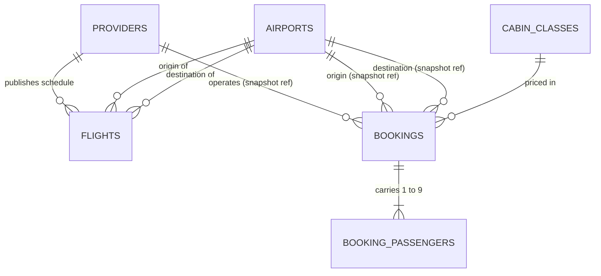

# SkyRoute Data Model Specification (Retroactive)

| Field | Value |
|---|---|
| Document ID | DATA-MODEL-001 |
| Date | 2026-07-07 |
| Author | database-engineer |
| Status | Approved (retroactive — PO directive) |
| Purpose | Definitive relational data model for SkyRoute: documents the schema the system should be backed by, maps it verifiably onto today's code, and serves as the migration blueprint when a real database replaces the in-memory store. |

Every constraint below is derived from actual code, cited by file. Paths are relative to the repository root. No rule in this document is invented.

---

## 1. Entity Catalog

### 1.1 Airports (reference data — 6 rows)

Source of truth: `src/Service/SkyRoute.Application/Data/AirportDataService.cs` (backend); mirrored per-layer by `src/UI/src/app/shared/constants/airports.constants.ts` (FR-055 — each layer owns its own copy).

| Attribute | Type | Constraint | Code evidence |
|---|---|---|---|
| Code | CHAR(3) | **PK.** Must match `^[A-Z]{3}$` | `SearchRequestValidator.cs` (`AirportCodeFormat` regex); `Airport.cs` |
| City | NVARCHAR(100) | NOT NULL | `Airport.cs` (`required string City`) |
| Country | NVARCHAR(100) | NOT NULL — drives route-type resolution (equal countries ⇒ Domestic) | `RouteTypeResolver.cs`; `AirportDataService.GetCountryOrNull` |
| DisplayName | NVARCHAR(150) | NOT NULL | `Airport.cs` |

### 1.2 Providers (reference data — 2 rows)

Today providers are code, not data (`GlobalAirProvider.cs`, `BudgetWingsProvider.cs`). Modeled as a table so pricing rules become data-auditable.

| Attribute | Type | Constraint | Code evidence |
|---|---|---|---|
| ProviderName | NVARCHAR(50) | **PK.** Values today: `GlobalAir`, `BudgetWings` (ordinal-matched, never free text) | `IFlightProvider.ProviderName`; `FlightFareResolver.cs` |
| PricingMultiplier | DECIMAL(5,4) | NOT NULL. GlobalAir = 1.15 (BR-001); BudgetWings = 0.90 (BR-002) | `GlobalAirProvider.ApplyGlobalAirPricing`; `BudgetWingsProvider.ApplyBudgetWingsPricing` |
| MinPriceFloor | DECIMAL(10,2) | NULL. BudgetWings = 29.99 (floor applied after 2dp rounding); GlobalAir = NULL | `BudgetWingsProvider.ApplyBudgetWingsPricing` (`Math.Max(discounted, 29.99m)`) |

### 1.3 CabinClasses (reference data — 3 rows; table, not enum)

Rationale for a lookup table over a DB enum: the cabin class carries a fare multiplier (behavioral data, not just a label), and `"First Class"` contains a space — a table row holds both cleanly. The single allow-list is `src/Service/SkyRoute.Application/Validation/CabinClasses.cs`; the frontend union type `CabinClass` in `src/UI/src/app/shared/models/search-request.model.ts` mirrors it.

| Attribute | Type | Constraint | Code evidence |
|---|---|---|---|
| CabinClass | NVARCHAR(20) | **PK.** Exactly `Economy`, `Business`, `First Class` | `CabinClasses.ValidCabinClasses`; enforced at `SearchRequestValidator.ValidateCabinClass` and `BookingRequestValidator.ValidateStructure` |
| FareMultiplier | DECIMAL(4,2) | NOT NULL. 1.00 / 2.00 / 3.50, applied to Economy base fare before the provider pricing rule | `src/Service/SkyRoute.Infrastructure/Providers/CabinClassMultipliers.cs` |

### 1.4 Flights (provider schedules — 8 fixture rows + deterministic generated rows)

Source: the two hardcoded `ProviderScheduleMapper.ScheduledFlight` fixture schedules (`GlobalAirProvider.cs` GA101/GA204/GA309/GA412; `BudgetWingsProvider.cs` BW210/BW225/BW238/BW241). Record shape: `src/Service/SkyRoute.Infrastructure/Providers/ProviderScheduleMapper.cs`.

Note (2026-07-07 route-coverage fix): each provider's schedule is those fixed fixtures **plus** entries from the deterministic route generator (`RouteScheduleGenerator.BuildFullSchedule`, flight numbers 500–555) covering every served ordered airport pair the fixtures miss (MAN↔SYD is the deliberate DEC-021 no-direct-service pair — zero rows in either direction) — both map to this same `ScheduledFlight`/Flights shape, so the entity model below is unchanged; only the row count grows (52 rows per provider). See `docs/features/feature-provider-aggregation.md` Section 3.3.

| Attribute | Type | Constraint | Code evidence |
|---|---|---|---|
| ProviderName | NVARCHAR(50) | **PK part 1**, FK → Providers | Schedules are owned per provider class |
| FlightNumber | NVARCHAR(10) | **PK part 2.** Fare lookup key is Provider+FlightNumber+CabinClass | `FlightFareResolver.TryResolveFare`; provider `TryResolveFare` methods |
| OriginCode | CHAR(3) | NOT NULL, FK → Airports. CHECK OriginCode <> DestinationCode | `ScheduledFlight.Origin`; route-match filter in `ProviderScheduleMapper.BuildResults` |
| DestinationCode | CHAR(3) | NOT NULL, FK → Airports | `ScheduledFlight.Destination` |
| DepartureTimeOfDay | TIME(0) | NOT NULL (`TimeOnly`; calendar date comes from the search request) | `ScheduledFlight.DepartureTimeOfDay`; `BuildResults` date construction |
| DurationMinutes | INT | NOT NULL, CHECK > 0 (arrival = departure + duration) | `ScheduledFlight.DurationMinutes`; `BuildResults` arrival computation |
| EconomyBaseFare | DECIMAL(10,2) | NOT NULL, CHECK > 0. All money rounds to 2dp `MidpointRounding.AwayFromZero` | `ScheduledFlight.EconomyBaseFare`; rounding in `BuildResults` and both pricing methods |

### 1.5 Searches — deliberately NOT persisted

Search is a stateless read path: `FlightAggregatorService` fans out to providers and returns results; nothing is written (`src/Service/SkyRoute.Api/Controllers/SearchController.cs` → no store dependency; `IBookingStore` is the only persistence contract, `src/Service/SkyRoute.Application/Interfaces/IBookingStore.cs`). No FR/BR requires search history, and persisting it would add write load on the hottest path with no consumer. **Decision: no Searches table.** If analytics are ever needed, add an append-only `SearchLog` (criteria only — origin, destination, date, passengerCount, cabinClass; no PII exists in a search) as a new, separate concern.

### 1.6 Bookings

Persisted aggregate root: `src/Service/SkyRoute.Application/Domain/Booking.cs` + embedded `BookingFlightSnapshot.cs` (AD-004: full flight snapshot, not a flight FK — snapshot fields are soft references so a schedule change never mutates history).

| Attribute | Type | Constraint | Code evidence |
|---|---|---|---|
| BookingReference | CHAR(14) | **PK / unique** (NFR-DATA-001). Format `^SKY-(INT|DOM)-[A-Z0-9]{6}$`; suffix from crypto RNG | `BookingReferenceGenerator.cs`; uniqueness via atomic `TryAdd` in `InMemoryBookingStore.CreateAsync` |
| TenantId | NVARCHAR(50) | NOT NULL DEFAULT `'default'` (DP-TENANT-005) | `Booking.cs`; `src/Service/SkyRoute.Infrastructure/Tenancy/DefaultTenantContext.cs` |
| RouteType | NVARCHAR(13) | NOT NULL, CHECK IN (`Domestic`,`International`). Server-resolved from airport countries; never client-trusted (NFR-DATA-004). *Materialized here — today only implicit in the reference prefix* | `RouteTypeResolver.cs` (unknown code defaults to International); `RouteType.cs` |
| ProviderName | NVARCHAR(50) | NOT NULL, FK → Providers (snapshot) | `BookingFlightSnapshot.Provider`; verified against registered providers by `FlightFareResolver` |
| FlightNumber | NVARCHAR(10) | NOT NULL (snapshot; must exist in provider schedule at booking time, else rejected) | `BookingRequestValidator.ValidateFare` (`fareResolved == false` ⇒ 400) |
| OriginCode / DestinationCode | CHAR(3) | NOT NULL, FK → Airports (snapshot) | `BookingFlightSnapshot.cs`; completeness check `BookingRequestValidator.IsFlightSnapshotComplete` |
| DepartureDateTimeUtc / ArrivalDateTimeUtc | DATETIME2(0) | NOT NULL, CHECK Arrival > Departure (arrival = departure + schedule duration) | `BookingFlightSnapshot.cs`; `ProviderScheduleMapper.BuildResults` |
| CabinClass | NVARCHAR(20) | NOT NULL, FK → CabinClasses. **One column** — today duplicated (`Booking.CabinClass` and `Flight.CabinClass`, both set from the same request field) | `Booking.cs`; `BookingService.CreateBookingWithUniqueReferenceAsync` |
| PricePerPassenger | DECIMAL(10,2) | NOT NULL, CHECK > 0. Server-re-resolved fare, exact match to client value required (SEC-001) | `BookingService.cs` step 3b; `FlightFareResolver.cs`; `BookingRequestValidator.ValidateFare` |
| PassengerCount | INT | NOT NULL, CHECK BETWEEN 1 AND 9 (SEC-002). Must equal COUNT of child rows (NFR-DATA-003). *Materialized — today derived from `Passengers.Count`* | `BookingRequestValidator.ValidateStructure` (1–9 bound + count-match rule); `SearchRequestValidator.ValidatePassengerCount` |
| TotalPrice | DECIMAL(10,2) | NOT NULL, CHECK > 0. = ROUND(PricePerPassenger × PassengerCount, 2, away-from-zero), server-computed (NFR-DATA-002) | `BookingService.CreateBookingAsync` step 4 |
| CreatedAtUtc | DATETIME2(3) | NOT NULL DEFAULT SYSUTCDATETIME(). Sort key for tenant listing | `Booking.cs`; `InMemoryBookingStore.ListByTenantAsync` (`OrderBy(CreatedAtUtc)`) |

### 1.7 BookingPassengers

Child of Bookings, 1..9 rows: `src/Service/SkyRoute.Application/Domain/PassengerDetail.cs`.

| Attribute | Type | Constraint | Code evidence |
|---|---|---|---|
| BookingPassengerId | INT IDENTITY | **PK** (surrogate — no natural key exists in code) | `PassengerDetail.cs` has no identifier |
| BookingReference | CHAR(14) | FK → Bookings, NOT NULL | `Booking.Passengers` list ownership |
| PassengerOrdinal | TINYINT | NOT NULL, CHECK 0–8; UNIQUE (BookingReference, PassengerOrdinal) — preserves request order | `passengers[{i}]` error keys in `BookingRequestValidator.cs` |
| FullName | NVARCHAR(100) | NOT NULL. 2–100 chars, ≥1 letter: `^(?=.*[A-Za-z]).{2,100}$` | `DocumentPatterns.FullNamePattern` |
| Age | TINYINT | NOT NULL, CHECK (Age BETWEEN 0 AND 120) (PO age feature 2026-07-08). Sanity bounds only — no business rule is bound to age (PO 2026-07-08, DEC-022; the same-day AGE-LEAD-18 lead-adult rule was removed by that decision) | `BookingRequestValidator.ValidateStructure` (`MinAge`/`MaxAge`); `PassengerDetail.cs` |
| Email | NVARCHAR(254) | NOT NULL. Pattern-checked, max 254 (RFC 5321, SEC-004) | `DocumentPatterns.EmailPattern` |
| DocumentType | NVARCHAR(11) | NOT NULL, CHECK IN (`Passport`,`National ID`). Must match booking RouteType: International ⇒ Passport, Domestic ⇒ National ID | `BookingRequestValidator.ValidateDocuments`; `DocumentPatterns.cs` (note the space in `National ID`) |
| DocumentNumber | NVARCHAR(20) | NOT NULL. Passport: `^[A-Z0-9]{6,9}$`; National ID: `^[A-Za-z0-9-]{5,20}$` | `DocumentPatterns.PassportPattern` / `NationalIdPattern`; mirrored in `src/UI/src/app/shared/validators/document-number.validators.ts` |

### 1.8 BookingReferences — folded into Bookings (no separate table)

The reference is the natural PK of Bookings; no separate reference registry exists in code. Uniqueness is enforced at the write itself — `ConcurrentDictionary.TryAdd` in `InMemoryBookingStore.CreateAsync` throws `DuplicateBookingReferenceException` (CR-003 TOCTOU fix), and `BookingService` retries with a fresh reference up to 10 times (`MaxReferenceGenerationAttempts`). In SQL this maps 1:1 to the PK/unique index rejecting the INSERT. A separate table would only be warranted for pre-allocating references across distributed writers — out of scope.

---

## 2. Relationships



Cardinality notes: every Flight belongs to exactly one Provider (PK includes ProviderName); every Booking has exactly one CabinClass and 1..9 BookingPassengers (`BookingRequestValidator.ValidateStructure`); full attribute/key lists are in §1 and the DDL in §5.1.

Note: Bookings→Flights is deliberately **not** a hard FK — AD-004 persists a snapshot so booked history is immutable if schedules change. Provider/Airport/CabinClass FKs on Bookings are safe because those are append-only reference data.

## 3. Mapping: Schema → C# → TypeScript (DTO/entity traceability)

| Schema entity.attribute | C# (file) | TypeScript (file) |
|---|---|---|
| Airports.* | `Airport.Code/City/Country/DisplayName` — `src/Service/SkyRoute.Application/Domain/Airport.cs`; rows in `Data/AirportDataService.cs` | `Airport` — `src/UI/src/app/shared/models/airport.model.ts`; rows in `shared/constants/airports.constants.ts` |
| Providers.ProviderName | `IFlightProvider.ProviderName` — `Interfaces/IFlightProvider.cs`; impls in `Infrastructure/Providers/*.cs` | `FlightResult.provider` (string) — `shared/models/flight-result.model.ts` |
| Providers.PricingMultiplier / MinPriceFloor | `ApplyGlobalAirPricing` / `ApplyBudgetWingsPricing` — `Infrastructure/Providers/GlobalAirProvider.cs`, `BudgetWingsProvider.cs` | n/a (server-only; UI re-derives totals in `shared/utils/pricing.util.ts`) |
| CabinClasses.* | `Validation/CabinClasses.cs`; `Infrastructure/Providers/CabinClassMultipliers.cs` | `CabinClass` union — `shared/models/search-request.model.ts` |
| Flights.* | `ProviderScheduleMapper.ScheduledFlight` — `Infrastructure/Providers/ProviderScheduleMapper.cs`; schedules in the two provider classes | surfaced as `FlightResult` — `shared/models/flight-result.model.ts` |
| Bookings.BookingReference | `Booking.BookingReference` — `Domain/Booking.cs`; format from `Services/BookingReferenceGenerator.cs` | `BookingResponse.bookingReference` — `shared/models/booking-request.model.ts` |
| Bookings snapshot columns | `BookingFlightSnapshot.*` — `Domain/BookingFlightSnapshot.cs`; request side `Contracts/BookingFlightRequest.cs` | `BookingFlightSnapshot` / `BookingFlightResponse` — `shared/models/booking-request.model.ts` |
| Bookings.CabinClass / TotalPrice / CreatedAtUtc / TenantId | `Booking.CabinClass/TotalPrice/CreatedAtUtc/TenantId` — `Domain/Booking.cs` | `BookingResponse.totalPrice/createdAtUtc` (TenantId server-only) |
| Bookings.PassengerCount | derived: `Booking.Passengers.Count`; request `BookingRequest.PassengerCount` — `Contracts/BookingRequest.cs` | `BookingRequest.passengerCount` — `shared/models/booking-request.model.ts` |
| Bookings.RouteType | computed: `RouteTypeResolver.Resolve` — `Services/RouteTypeResolver.cs`; enum `Domain/RouteType.cs` | advisory copy: `resolveRouteType` — `shared/validators/document-number.validators.ts` |
| BookingPassengers.* | `PassengerDetail.*` — `Domain/PassengerDetail.cs`; request `Contracts/PassengerRequest.cs`; response (name + age only) `Contracts/PassengerNameResponse.cs` | `PassengerDetail` / `PassengerNameResponse` — `shared/models/passenger-detail.model.ts` |
| BookingPassengers.Age | `PassengerDetail.Age` — `Domain/PassengerDetail.cs`; request `PassengerRequest.Age` (nullable `int?` so a missing value 400s); response `PassengerNameResponse.Age`; rules in `Validation/BookingRequestValidator.cs` (0–120 sanity bounds only, DEC-022) | `PassengerDetail.age` / `PassengerNameResponse.age` — `shared/models/passenger-detail.model.ts`; mirrored `ageValidator`/`AGE_MIN`/`AGE_MAX` — `shared/validators/document-number.validators.ts` |

## 4. Current-State Persistence Note

Persistence today is **in-memory only**: `InMemoryBookingStore` (`src/Service/SkyRoute.Infrastructure/Persistence/InMemoryBookingStore.cs`), a singleton `ConcurrentDictionary<string, Booking>` keyed by booking reference, behind `IBookingStore` (the sole persistence contract; no persistence-technology type leaks through it — DP-PERSIST-001). Data does not survive restart. Airports, provider schedules, and cabin multipliers are hardcoded constants, not stored data.

| Integrity rule | Enforced today by | Moves to schema? |
|---|---|---|
| Booking reference unique (NFR-DATA-001) | `TryAdd` + `DuplicateBookingReferenceException` + service retry | Yes — PK/unique index |
| Reference format SKY-INT/DOM-XXXXXX | `BookingReferenceGenerator` only (store never checks format) | Yes — CHECK constraint (defense in depth) |
| PassengerCount 1–9; count == rows | `BookingRequestValidator` | CHECK 1–9 yes; count==rows stays app-enforced (cross-table) |
| Document type ↔ route type; document/email/name patterns | `BookingRequestValidator` + `DocumentPatterns` | Type allow-list + lengths yes; regex + route-match stay app-enforced |
| Age 0–120 per passenger (sanity bounds only; no business rule bound to age — PO 2026-07-08, DEC-022) | `BookingRequestValidator.ValidateStructure` | Yes — CHECK 0–120 |
| Fare authenticity, total = price × count (NFR-DATA-002) | `FlightFareResolver` + `BookingService` recomputation | Stays app-enforced (CHECK > 0 only in schema) |
| Route type server-resolved (NFR-DATA-004) | `RouteTypeResolver` | Stays app-enforced; result materialized as column |
| Tenant scoping | `ListByTenantAsync` filter only (single-tenant MVP) | Yes — NOT NULL + index; row-level isolation when multi-tenant |

## 5. Migration Blueprint

### 5.1 DDL Sketch (T-SQL)

```sql
CREATE TABLE Airports (
  Code CHAR(3) NOT NULL CONSTRAINT PK_Airports PRIMARY KEY,
  City NVARCHAR(100) NOT NULL, Country NVARCHAR(100) NOT NULL, DisplayName NVARCHAR(150) NOT NULL,
  CONSTRAINT CK_Airports_Code CHECK (Code LIKE '[A-Z][A-Z][A-Z]'));

CREATE TABLE Providers (
  ProviderName NVARCHAR(50) NOT NULL CONSTRAINT PK_Providers PRIMARY KEY,
  PricingMultiplier DECIMAL(5,4) NOT NULL CONSTRAINT CK_Providers_Mult CHECK (PricingMultiplier > 0),
  MinPriceFloor DECIMAL(10,2) NULL);            -- 29.99 for BudgetWings, NULL for GlobalAir

CREATE TABLE CabinClasses (
  CabinClass NVARCHAR(20) NOT NULL CONSTRAINT PK_CabinClasses PRIMARY KEY,
  FareMultiplier DECIMAL(4,2) NOT NULL CONSTRAINT CK_CabinClasses_Mult CHECK (FareMultiplier >= 1.00));

CREATE TABLE Flights (
  ProviderName NVARCHAR(50) NOT NULL CONSTRAINT FK_Flights_Provider REFERENCES Providers,
  FlightNumber NVARCHAR(10) NOT NULL,
  OriginCode CHAR(3) NOT NULL CONSTRAINT FK_Flights_Origin REFERENCES Airports,
  DestinationCode CHAR(3) NOT NULL CONSTRAINT FK_Flights_Dest REFERENCES Airports,
  DepartureTimeOfDay TIME(0) NOT NULL,
  DurationMinutes INT NOT NULL CONSTRAINT CK_Flights_Duration CHECK (DurationMinutes > 0),
  EconomyBaseFare DECIMAL(10,2) NOT NULL CONSTRAINT CK_Flights_Fare CHECK (EconomyBaseFare > 0),
  CONSTRAINT PK_Flights PRIMARY KEY (ProviderName, FlightNumber),
  CONSTRAINT CK_Flights_Route CHECK (OriginCode <> DestinationCode));

CREATE TABLE Bookings (
  BookingReference CHAR(14) NOT NULL CONSTRAINT PK_Bookings PRIMARY KEY,   -- NFR-DATA-001
  TenantId NVARCHAR(50) NOT NULL CONSTRAINT DF_Bookings_Tenant DEFAULT 'default',
  RouteType NVARCHAR(13) NOT NULL CONSTRAINT CK_Bookings_RouteType CHECK (RouteType IN ('Domestic','International')),
  ProviderName NVARCHAR(50) NOT NULL CONSTRAINT FK_Bookings_Provider REFERENCES Providers,
  FlightNumber NVARCHAR(10) NOT NULL,           -- snapshot: intentionally NOT FK to Flights (AD-004)
  OriginCode CHAR(3) NOT NULL CONSTRAINT FK_Bookings_Origin REFERENCES Airports,
  DestinationCode CHAR(3) NOT NULL CONSTRAINT FK_Bookings_Dest REFERENCES Airports,
  DepartureDateTimeUtc DATETIME2(0) NOT NULL, ArrivalDateTimeUtc DATETIME2(0) NOT NULL,
  CabinClass NVARCHAR(20) NOT NULL CONSTRAINT FK_Bookings_Cabin REFERENCES CabinClasses,
  PricePerPassenger DECIMAL(10,2) NOT NULL CONSTRAINT CK_Bookings_Price CHECK (PricePerPassenger > 0),
  PassengerCount INT NOT NULL CONSTRAINT CK_Bookings_PaxCount CHECK (PassengerCount BETWEEN 1 AND 9),
  TotalPrice DECIMAL(10,2) NOT NULL CONSTRAINT CK_Bookings_Total CHECK (TotalPrice > 0),
  CreatedAtUtc DATETIME2(3) NOT NULL CONSTRAINT DF_Bookings_Created DEFAULT SYSUTCDATETIME(),
  CONSTRAINT CK_Bookings_RefFormat CHECK (BookingReference LIKE 'SKY-INT-%' OR BookingReference LIKE 'SKY-DOM-%'),
  CONSTRAINT CK_Bookings_Times CHECK (ArrivalDateTimeUtc > DepartureDateTimeUtc));

CREATE TABLE BookingPassengers (
  BookingPassengerId INT IDENTITY NOT NULL CONSTRAINT PK_BookingPassengers PRIMARY KEY,
  BookingReference CHAR(14) NOT NULL CONSTRAINT FK_BookingPassengers_Booking REFERENCES Bookings,
  PassengerOrdinal TINYINT NOT NULL CONSTRAINT CK_BP_Ordinal CHECK (PassengerOrdinal BETWEEN 0 AND 8),
  FullName NVARCHAR(100) NOT NULL CONSTRAINT CK_BP_Name CHECK (LEN(FullName) >= 2),
  Age TINYINT NOT NULL CONSTRAINT CK_BP_Age CHECK (Age BETWEEN 0 AND 120),  -- sanity bounds only; no business rule bound to age (DEC-022)
  Email NVARCHAR(254) NOT NULL,
  DocumentType NVARCHAR(11) NOT NULL CONSTRAINT CK_BP_DocType CHECK (DocumentType IN ('Passport','National ID')),
  DocumentNumber NVARCHAR(20) NOT NULL CONSTRAINT CK_BP_DocLen CHECK (LEN(DocumentNumber) BETWEEN 5 AND 20),
  CONSTRAINT UQ_BP_Ordinal UNIQUE (BookingReference, PassengerOrdinal));
```

### 5.2 Indexing

- `PK_Bookings` (clustered unique on `BookingReference`) — replaces `ConcurrentDictionary.TryAdd` atomicity; serves `GetByReferenceAsync`/`ExistsAsync`.
- `IX_Bookings_TenantId_CreatedAtUtc` on `(TenantId, CreatedAtUtc)` — serves `ListByTenantAsync`'s filter + order + pagination exactly.
- `IX_Flights_Route` on `(OriginCode, DestinationCode)` — serves the search route-match filter in `ProviderScheduleMapper.BuildResults`.
- `IX_BookingPassengers_BookingReference` — child-row retrieval per booking.

### 5.3 Phased Adoption (EF Core)

1. **Phase A — mapping only.** Add `SkyRouteDbContext` in `SkyRoute.Infrastructure/Persistence/`. Keep domain POCOs annotation-free (DP-PERSIST-002): all mapping via Fluent API — `HasPrecision(10,2)` for money, `BookingFlightSnapshot` as an owned type flattened onto the Bookings columns above, `Passengers` as `OwnsMany`/`HasMany` to `BookingPassengers` with an ordinal shadow/order column, `TimeOnly`/`DateOnly` mapped natively (EF Core 8+).
2. **Phase B — store swap.** Implement `SqlBookingStore : IBookingStore`; translate unique-key violation (SQL Server error 2627/2601) into `DuplicateBookingReferenceException` so `BookingService`'s existing retry loop works unchanged. Swap the DI registration in `Program.cs` — no controller/service edits (DP-PERSIST-003, NFR-MAINT-001).
3. **Phase C — reference data.** Seed Airports/Providers/CabinClasses/Flights from the constants in §1 via `HasData`; providers may keep code-based pricing initially (table columns become the audit source, code remains the executor).
4. **Requires human approval before starting** (new dependency: EF Core packages + a database) per CLAUDE.md §21.

### 5.4 Ad-Hoc Modeling Issues Corrected on Paper

1. `CabinClass` stored twice per booking (`Booking.CabinClass` + `BookingFlightSnapshot.CabinClass`, always identical) → one column.
2. `RouteType` computed but never persisted (only implicit in the reference prefix) → materialized column with CHECK.
3. `PassengerCount` never persisted (derived from list length) → materialized with CHECK 1–9.
4. `DurationMinutes` silently dropped between `FlightResult` and `BookingFlightSnapshot` → derivable (`Arrival − Departure`); not re-added.
5. Reference data (airports, schedules, multipliers, pricing rules) scattered across four hardcoded constant locations → four reference tables; the frontend keeps its own display copy per FR-055.
